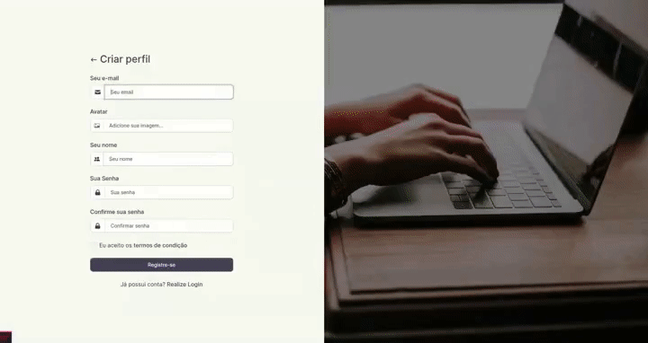

# Laravel Project Manager

 

  

 

## Tópicos

[Tecnologias](#tecnologias)

[Instalação](#instalacao)

[Creditos de imagens](#creditos-de-imagens)

 

## Tecnologias

Tecnologias e ferramentas utilizadas no desenvolvimento da aplicação:

- [Laravel](https://laravel.com/)
- [Bootstrap](https://getbootstrap.com/)

 

## Instalação

### Rodando o servidor
sudo docker compose up --build

## Entre no terminal
sudo docker exec -it php-apache bash

### Criando projeto Laravel
composer create-project laravel/laravel .

### Atualize
composer update

### Gere a key da aplicação
php artisan key:generate 

### Gerar Migrate
php artisan migrate

### Ajustando erros de permissão
chmod -R 777 /var/www/php/

 

## Creditos de imagens

As imagens utilizadas para a tela de login e cadastro foram obtidas do site [unsplash](unsplash), que armazena imagens gratuitas. Abaixo os créditos aos autores das imagens:

[Bonnie Kittle](https://unsplash.com/@bonniekdesign?utm_source=unsplash&utm_medium=referral&utm_content=creditCopyText)
[Christin Hume](https://unsplash.com/@christinhumephoto?utm_source=unsplash&utm_medium=referral&utm_content=creditCopyText)